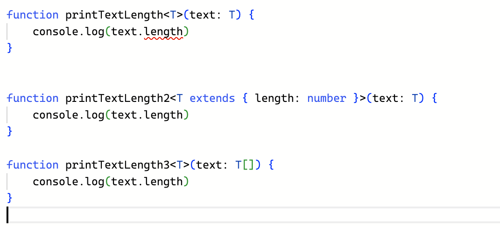

# 10.1 제네릭이란?
* 타입을 미리 정의하지 않고 사용하는 시점에 원하는 타입을 정의해서 쓸 수 있는 문법이다.
* `타입을 넘기고 그 타입을 그대로 반환받는다`는 것이 바로 제네릭이다.

# 10.2 제네릭 기본 문법
```ts
function getText<T>(text: T): T {
    return text;
}

getText<string>('hi'); // hi
function getText(text: string): string {
    return text;
}
```
# 10.3 왜 제네릭을 사용할까?
## 중복되는 타입 코드의 문제점
* 함수의 역할과 동작은 같은데 타입이 다르기 때문에 함수를 분리해서 문자열 텍스트용 함수와 숫자 텍스트용 함수를 선언해 주어야 하므로 같은 동작을 하는 코드를 중복해서 선언해야 한다.

## any를 쓰면 되지 않을까?
* any를 사용하면 타입스크립트 장점들이 사라진다.
* 타입스크립트의 코드 자동 완성이나 에러의 사전 방지 이점을 얻지 못하므로 애플리케이션이 실제로 실행할 때 에러를 발견하게 된다.

## 제네릭으로 해결되는 문제점
* 동일한 동작의 코드를 타입 때문에 중복으로 선언하는 문제점과 any 타입으로 선언하면서 생기는 문제점은 제네릭으로 모두 해결할 수 있다.
* 제네릭을 사용하면 함수의 타입을 지정하여 사용하는 듯한 효과를 얻을 수 있다.

# 10.4 인터페이스에 제네릭 사용하기
* 제네릭은 함수뿐만 아니라 인터페이스에도 사용할 수 있다.
* 제네릭을 사용하여 타입을 유연하게 확장할 수 있다.
```ts
interface ProductDropdown {
    value: string;
    selected: boolean;
}

interface StockDropdown {
    value: number;
    selected: boolean;
}

interface AddressDropdown {
    value: { city: string, zipCode: string };
    selected: boolean;
}

const product: ProductDropdown;
const stock: StockDropdown;
const address: AddressDropdown;

interface Dropdown<T> {
    value: T;
    selected: boolean;
}

const product: Dropdown<string>;
const stock: Dropdown<number>;
const address: Dropdown<{ city: string, zipCode: string }>;
```

# 10.5 제네릭의 타입 제약
## extends를 사용한 타입 제약
* 제네릭의 장점은 유연하게 확장한다는 점인데 반대로 생각하면 타입을 별도로 제약하지 않고 아무 타입이나 받아서 사용할 수 있다는 의미이다.
* extends를 사용하면 제네릭으로 원하는 타입만 받을 수 있다.


## 타입 제약의 특징
* 제네릭의 타입 제약은 하나의 특정 타입뿐만 아니라 특정 범위에 해당하는 여러개의 타입을 대상으로 지정할 수 있다.
```ts
function lengthOnly<T extends { length: number }>(value: T) {
    return value.length;
}

lengthOnly('hi') // No Error
lengthOnly([1,2,3]) // No Error
lengthOnly({ title: 'test', length: 10 }) // No Error
lengthOnly(10) // Error
```

## keyof를 사용한 타입 제약
* `keyof`는 특정 타입의 키 값을 추출해서 문자열 유니언 타입으로 변환해준다.
* `extends`를 이용해서 제네릭의 타입을 제약할 때 `keyof`를 함께 사용하여 타입의 제약 조건을 까다롭게 만들 수 있다.


# 10.6 제네릭을 처음 사용할 때 주의해야 할 사고방식
* 제네릭을 처음 사용할 때 가장 헷갈리는 부분은 함수 안에서 제네릭으로 받은 타입을 다룰 때이다.
* `extends`를 사용하여 타입을 제한하면서 함수 내에서 값의 속성 사용에 대해서 타입스크립트 컴파일러에게 힌트를 줄 수 있다.
* 파라미터에 제네릭 타입이 연결되어 있으면 함수를 호출할 때 명시적으로 제네릭에 타입을 선언하지 않아도 된다.


# 10.7 정리
* 제네릭을 사용하면 불필요하게 중복되는 타입 코드를 줄이고, 타입스크립트의 이점인 코드 자동 완성도 활용할 수 있다.
* 함수에 미리 타입을 정의하지 않고 호출하는 시점에 타입을 정의할 수 있어 유연하게 타입을 확장해 나갈 수 있다.
* `extends`, `keyof` 키워드를 사용하여 제네릭에 넘길 타입을 제약하기도 하고, 때로는 특정 속성에 대한 힌트를 줄 수도 있다.


