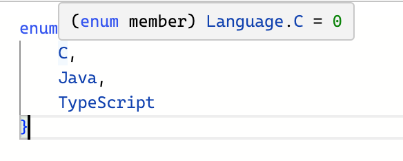

# 15.1 타입 호환이란?
* 서로 다른 타입이 2개 있을 때 특정 타입이 다른 타입에 포함되는지를 의미한다.
```ts
// 타입스크립트는 문자열 타입에 숫자 타입을 할당할 수 없으므로 에러가 발생한다.
// b의 타입과 a의 타입은 서로 호환되지 않는다고 표현할 수 있다.
let a: string = 'hi'
let b: number = 10;

b = a; // Type 'string' is not assignable to type 'number'.
```   
```js
// 자바스크립트는 미리 변수의 타입을 지정하지 않아도 실행하는 시점에 적절한 타입으로 변환해 주기 때문에 아래 코드가 정상적으로 동작한다.
let a = 'hi';
let b = 10;

b = a // 타입 캐스팅 동작으로 인해 문자열 'hi'가 할당되면서 문자 타입으로 변환된다.
```
```ts
// 위 예시를 타입이 서로 호환되는 경우를 보면 아래와 같다.
let a: string = 'hi';
let b: 'hi' = 'hi';

// b를 a에 할당했을 때 별도의 타입 에러가 발생하지 않으므로 a와 b의 타입은 서로 호환된다고 볼 수 있다.
// string 타입이 'hi' 타입보다 더 큰 타입이므로 'hi'를 포함할 수 있는 관계이다.
a = b; // No Error
b = a; // Type 'string' is not assignable to type '"hi"'
```

# 15.2 다른 언어와 차이점
* 타입 스크립트의 타입 호환이라는 개념은 다른 언어와 차이가 있다.

```ts
// Avengers 클래스가 명시적으로 Ironman 인터페이스를 상속받아 구현하지 않아도 에러가 발생하지 않는다.
// 에러가 발생하지 않는 이유는 타입스크립트의 '구조적 타이핑' 특성 때문이다.
interface Ironman {
    name: string;
}

class Avengers {
    name: string;
}

let i: Ironman;
i = new Avengers();
```
## 구조적 타이핑
* 타입 유형보다는 타입 구조로 호환 여부를 판별하는 언어적 특성을 의미한다.
* 타입스크립트는 타입의 정의된 생김새와 구조로 타입 호환 여부를 판별한다.
    * 타입스크립트는 해당 타입이 어떤 타입 구조를 갖고 있는지로 타입 호환 여부를 판별한다.
    * 타입 호환 여부를 판별할 때는 단순히 타입의 특정 속성 유무만 보지 않고 속성 이름까지 일치하는지 확인한다.
    * 객체 타입은 타입 유형에 관계없이 동일한 이름의 속성을 갖고 있고 속성의 타입이 같으면 호환 가능하다.
```ts
// 타입 별칭과 인터페이스는 모두 문자열 타입의 name 속성을 갖고 있기 때문에 타입 구조가 같다고 볼 수 있다.
type Captain = {
    name: string;
}

interface Antman {
    name: string;
}

let a: Captain = {
    name: '캡틴'
};

let b: Antman = {
    name: '앤트맨'
};

b = a;

// name -> nickname으로 속성명이 바뀐다면 에러가 발생한다. 
interface Antman {
    nickname: string;
}

let b: Antman = {
    nickname: '앤트맨'
};

b = a; // Property 'nickname' is missing in type 'Captain' but required in type 'Antman'.
```

# 15.3 객체 타입의 호환
```ts
// Person 타입 별칭과 Developer 인터페이스가 모두 동일한 이름의 속성을 갖고 있고, 해당 속성 타입이 같기 때문에 호환 가능하다.
type Person = {
    name: string;
}

interface Developer {
    name: string;
}

let joo: Person = {
    name: '형주'
}

let capt: Developer = {
    name: '캡틴'
}

joo = capt;
capt = joo;
```
```ts
// Developer 타입이 Person 타입에 호환된다.
// Person 타입 입장에서는 호환하는데 필요한 조건인 문자열 타입의 name 속성이 정의되어 있기 때문에 호환되는 것으로 간주한다.
type Person = {
    name: string;
}

interface Developer {
    name: string;
    skill: string;
}

let joo: Person = {
    name: '형주'
}

let capt: Developer = {
    name: '캡틴',
    skill: '방패 던지기'
}

joo = capt;

// Person 타입이 Developer 타입에 호환되지 않아 에러가 발생한다.
// Developer 타입에 호환되기 위한 조건으로 skill, name 속성 및 타입이 맞아야 한다.
capt = joo; // Property 'skill' is missing in type 'Person' but required in type 'Developer'.

// skill 속성을 옵셔널로 변경
interface Developer {
    name: string;
    skill: string;
}

// skill 속성 추가
type Person = {
    name: string;
    skill: string;
}
```

# 15.4 함수 타입의 호환
* 함수 타입도 구조적 타이핑 관점에서 함수 구조가 유사하면 호환된다.
* 함수의 타입 호환은 `기존 함수 코드의 동작을 보장해 줄 수 있는가?`라는 관점에서 이해하는 것이 좋다.
* 특정 함수 타입의 부분 집합에 해당하는 함수는 호환되지만, 더 크거나 타입을 만족하지 못하는 함수는 호환되지 않는다.
```ts
// 함수가 호환되는 경우
let add = function(a: number, b: number) {
    return a + b;
}

let sum = function(x: number, y: number) {
    return x + y;
}

add = sum;
sum = add;
```
```ts
// 함수가 호환되지 않는 경우
// 함수의 로직을 보장하고자 타입 레벨에서 에러를 표시한다.
let getNumber = function(num: number) {
    return num;
}

let sum = function(x: number, y: number) {
    return x + y;
}

console.log(getNumber(10)) // 10
getNumber = sum; // Type '(x: number, y: number) => number' is not assignable to type '(num: number) => number'.
console.log(getNumber(10)) // NaN

console.log(sum(10, 20)) // 30
sum = getNumber; // No Error
console.log(sum(10, 20)) // 10
```

# 15.5 이넘 타입의 호환
* 이넘 타입은 값 여러 개를 하나로 묶어서 사용해야 할 때 활용되는 타입이다. 이넘을 선언하면 기본적으로 숫자 값을 갖는다.


## 숫자형 이넘과 호환되는 number 타입
* 숫자형 이넘은 숫자 타입과 호환된다.
```ts
enum Language {
    C,
    Java,
    TypeScript
}

let a: number = 10;
a = Language.C;
```

## 이넘 타입간 호환 여부
* 이넘 타입은 같은 속성과 값을 가졌더라도 이넘 타입 간에는 서로 호환되지 않는다.
```ts
enum Language {
    C,
    Java,
    TypeScript
}

enum Programming {
    C,
    Java,
    TypeScript
}

let langC: Language.C;
langC = Programming.C; // Type 'Programming.C' is not assignable to type 'Language.C'.
```

# 15.6 제네릭 타입의 호환
* 제네릭으로 받은 타입이 해당 타입 구조에서 사용되었는지에 따라 결정된다.
```ts
// 각각 다른 타입을 제네릭 타입으로 넘겼지만 두 타입은 서로 호환된다.
// 제네릭으로 받은 타입이 해당 타입 구조에서 사용되지 않는다면 타입 호환에 영향을 미치지 않는다.
interface Empty<T> {

}

let empty1: Empty<string> = {};
let empty2: Empty<number> = {};

empty2 = empty1;
empty1 = empty2;
```
```ts
// 두 타입은 호환되지 않는다.
// 제네릭으로 받은 타입이 해당 타입 구조 내에서 사용되었는지 확인하면 된다.
interface NotEmpty<T> {
    data: T;
}

let notEmpty1: NotEmpty<string> = {};
/*
interface NotEmpty<string> {
    data: string;
}
*/
let notEmpty2: NotEmpty<number> = {};
/*
interface NotEmpty<number> {
    data: number;
}
*/

notEmpty2 = notEmpty1; // Type 'NotEmpty<string>' is not assignable to type 'NotEmpty<number>'.
notEmpty1 = notEmpty2; // Type 'NotEmpty<number>' is not assignable to type 'NotEmpty<string>'.
```

# 정리
* 타입스크립트는 다른 타입 언어와 다르게 타입 구조와 생김새로 타입을 구분하는데 이를 `구조적 타이핑`이라 한다.
* 객체 타입과 함수 타입이 호환되려면 각 타입의 최소 조건을 만족해야 한다.
* 이넘 타입은 이넘끼리 호환되지 않고 숫자형 이넘은 숫자 타입과 호환된다.
* 제네릭 타입은 받은 타입의 사용 여부에 따라 타입 호환이 구분된다.