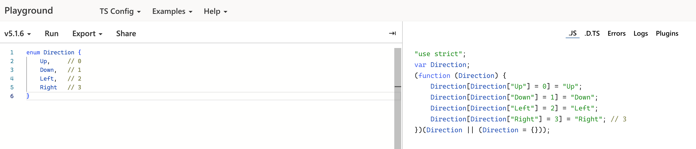
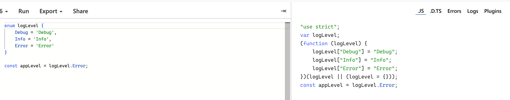
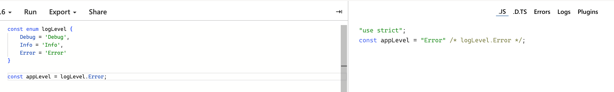

# 8.1 이넘이란?
* `이넘`은 특정 값의 집합을 의미하는 데이터 타입이다.
* 상수 집합이라고도 표현한다.
* 비슷한 성격이나 같은 범주에 있는 상수를 하나로 묶어 더 큰 단위의 상수로 만드는 것이 이넘의 역할이다.
```ts
enum ShoesBrand {
    Nike,
    Adidas,
    NewBalance
}
const myShoes = ShoesBrand.Nike;
const yourShoes = ShoesBrand.NewBalance;
```

# 8.2 숫자형 이넘
* 이넘에 선언된 속성은 기본적으로 숫자 값을 가진다.
```ts
enum Direction {
    Up,     // 0
    Down,   // 1
    Left,   // 2
    Right   // 3
}

console.log(Direction.Up); // 0
```
* 이넘의 속성과 값이 거꾸로 연결되어 할당되는 것을 `리버스 매핑`이라고 한다.


# 8.3 문자형 이넘
* 이넘의 속성 값에 문자열을 연결한 이넘을 의미한다.
```ts
enum Direction {
    Up = 'Up';
    Down = 'Down';
    Left = 'Left';
    Right = 'Right';
}

enum Direction {
    UP = 'UP';
    DOWN = 'DOWN';
    LEFT = 'LEFT';
    RIGHT = 'RIHGT';
}
```

# 8.4 알아 두면 좋은 이넘의 특징
## 혼합 이넘
* 이넘을 숫자와 문자열을 섞어서 선언할 수 있다.
* 코드상으로 문제는 없으나 이넘 값은 일괄되게 하나의 데이터 타입으로 관리하는 것이 좋다.
```ts
enum Answer {
    Yes = 'Yes',
    No = 1
}
```

## 다양한 이넘 속성 값 정의 방식
* 먼저 선언되어 있는 이넘의 속성을 활용할 수 있다.
* 덧셈 연산자를 사용하여 계산한 값을 속성 값으로 할당할 수 있다.
```ts
enum Authorization {
    User,                       // 0
    Admin,                      // 1
    SuperAdmin = User + Admin,  // 1
    God = 'abc'.length          // 3
}
```

## const 이넘
* 이넘을 선언할 때 앞에 `const`를 붙인 이넘을 의미한다.
* `const`를 이넘 앞에 붙이는 이유는 컴파일 결과물의 코드양을 줄이기 위해서다.



# 8.5 정리
* 여러 개의 상수를 하나의 단위로 묶어서 사용할 때 정해진 옵션을 파악하기 쉽다.
* 이넘의 속성 값은 기본적으로 숫자로 지정되고, 원하면 속성마다 숫자나 문자열을 지정할 수 있다.
* 속성 값에 문자열을 명시적으로 지정하는 문자형 이넘 방식이 가장 많이 활용된다.