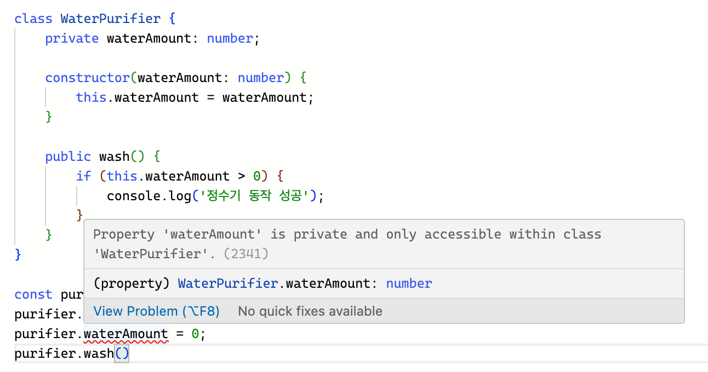

# 9.1 클래스란?
* 여러 가지 유사한 객체를 쉽게 생성하는 자바스크립트 최신 문법이다.
> ES6는 ECMAScript 2015를 의미하고,  
> ES6+는 ECMAScript 2015 ~ 현재를 의미한다.

# 9.2 클래스 기본 문법
```ts
class Person {
    constructor(name, skill) {  // 생성자 메소드
        this.name = name;       // 클래스 필드 또는 클래스 속성
        this.skill = skill;     // 클래스 필드 또는 클래스 속성
    }

    sayHi() {                   // 클래스 메서드
        console.log('hi');
    }
}
```

* 아래와 같이 클래스로 생성된 객체를 클래스 인스턴스라고 한다.

# 9.3 클래스의 상속
* 부모 클래스의 속성과 메서드 등을 자식 클래스에서도 사용할 수 있게 물려준다는 의미이다.
* 상속을 하면 클래스 인스턴스뿐만 아니라 자식 클래스 코드 내부에서도 부모 클래스의 속성이나 메서드를 접근할 수 있다.
* 클래스를 상속받으면 기존 클래스에 정의된 속성과 메서드를 재활용할 수 있어 객체 지향 프로그래밍에 유용하다.

# 9.4 타입스크립트의 클래스
```ts
class Chatgpt {
    name: string

    constructor(name: string) {
        this.name = name;
    }

    sum(a: number, b: number): number {
        return a + b;
    }
}
```

# 9.5 클래스 접근 제어자
* 접근 제어자는 클래스 속성의 노출 범위를 정의할 수 있다.

## 클래스 접근 제어자의 필요성
```ts
class WaterPurifier {
    waterAmount: number;

    constructor(waterAmount: number) {
        this.waterAmount = waterAmount;
    }

    wash() {
        if (this.waterAmount > 0) {
            console.log('정수기 동작 성공');
        }
    }
}

const purifier = new WaterPurifier(30);
purifier.wash(); // 정수기 동작 성공
purifier.waterAmount = 0;
purifier.wash();
```

## 클래스 접근 제어자: public, private, protected
* 클래스 접근 제어자는 다음 3가지이다.
  * public
  * private
  * protected

### public
* public 접근 제어자는 클래스 안에 선언된 속성과 메서드를 어디서든 접근할 수 있다.
* 클래스 속성과 메서드에 별도로 속성 접근 제어자를 선언하지 않으면 기본 값은 public이다.
```ts
class WaterPurifier {
    public waterAmount: number;

    constructor(waterAmount: number) {
        this.waterAmount = waterAmount;
    }

    public wash() {
        if (this.waterAmount > 0) {
            console.log('정수기 동작 성공');
        }
    }
}
```

### private
* private 접근 제어자는 클래스 코드 외부에서 클래스의 속성과 메서드를 접근할 수 없다.
* 클래스 안 로직을 외부로부터 단절시켜 보호할 때 주로 사용한다.
```ts
class WaterPurifier {
    private waterAmount: number;

    constructor(waterAmount: number) {
        this.waterAmount = waterAmount;
    }

    private wash() {
        if (this.waterAmount > 0) {
            console.log('정수기 동작 성공');
        }
    }
}
```

### protected
* protected 접근 제어자로 선언된 속성이나 메서드는 클래스 코드 외부에서 사용할 수 없다. (다만 상속받은 클래스에서는 사용할 수 있다.)
```ts
class Person {
    private name: string;
    private skill: string;

    constructor(name: string, skill: string) {
        this.name = name;
        this.skill = skill;
    }

    protected sayHi(): void {
        console.log('hi');
    }
}

class Developer extends Person {
    constructor(name: string, skill: string) {
        super(name, skill);
        this.sayHi();
    }

    coding(): void {
        console.log('fun doing ' + this.name + ' by ' + this.skill);
    }
}
```
## 클래스 접근 제어자로 정수기 문제 해결하기


## 클래스 접근 제어자를 사용할 때 주의해야 할 점
* 타입스크립트의 접근 제어자가 지정되어 있더라도 실행 시점의 에러까지는 보장해 주지 못한다.

